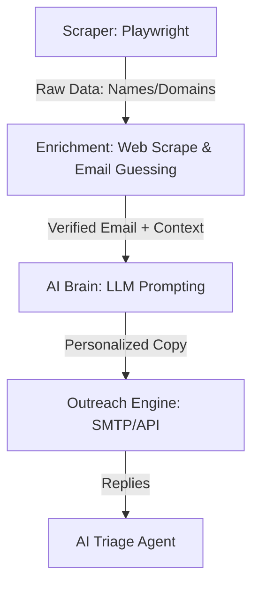

# The Zero-Cost Agency: Automating B2B Lead Gen with AI

## Table of Contents
1. [Introduction: The Zero-Cost Agency Paradigm](#chapter-1-introduction-the-zero-cost-agency-paradigm)
2. [Architecture of an Automated Lead Gen Engine](#chapter-2-architecture-of-an-automated-lead-gen-engine)
3. [Sourcing Leads at Scale: Playwright & Headless Scraping](#chapter-3-sourcing-leads-at-scale-playwright--headless-scraping)
4. [Data Enrichment: Turning Names into Profiles](#chapter-4-data-enrichment-turning-names-into-profiles)
5. [The AI Sales Agent: LLMs for Personalization](#chapter-5-the-ai-sales-agent-llms-for-personalization)
6. [Cold Outreach Infrastructure: Deliverability & Templates](#chapter-6-cold-outreach-infrastructure-deliverability--templates)
7. [Tying It All Together: Orchestration & Automation](#chapter-7-tying-it-all-together-orchestration--automation)
8. [Conclusion & Next Steps](#chapter-8-conclusion--next-steps)

---

## Chapter 1: Introduction: The Zero-Cost Agency Paradigm

The traditional agency model is dead. Or, at least, the traditional cost structure of the agency model is dead. Historically, scaling a B2B lead generation agency required an army of SDRs (Sales Development Representatives), expensive subscriptions to databases like ZoomInfo or Apollo, and massive overhead in management and training. 

Today, the "Zero-Cost Agency" leverages open-source tools, inexpensive APIs, and Large Language Models (LLMs) to perform the work of a 50-person sales floor at a fraction of a cent per lead. This book is a technical manual for building exactly that. 

We will bypass the bloated SaaS subscriptions. Instead of paying $10,000/year for lead data, we will build scrapers. Instead of hiring copywriters, we will engineer prompts. Instead of manual data entry, we will build an automated pipeline.

---

## Chapter 2: Architecture of an Automated Lead Gen Engine

To build a zero-cost infrastructure, you need an architecture that is modular, scalable, and resilient. Here is the blueprint for our AI Lead Gen Agent.

### The 4-Pillar Architecture

1.  **The Extraction Layer (Playwright/Node.js):** Navigates target directories (e.g., Clutch.co, LinkedIn via stealth, Google Maps) to extract raw company and contact data.
2.  **The Enrichment Layer (Python/APIs):** Takes raw domains and names, finds email addresses (using tools like Hunter.io API or custom SMTP validation), and scrapes the company's website to understand their exact value proposition.
3.  **The Brain Layer (LLM/OpenAI/Gemini):** Processes the scraped website data and the prospect's profile to generate hyper-personalized icebreakers and email copy.
4.  **The Execution Layer (Make.com/n8n/Mail APIs):** Orchestrates the workflow and dispatches emails via API (e.g., SendGrid, Mailgun, or directly via Google Workspace APIs) while managing bounce rates and replies.

### System Diagram



---

## Chapter 3: Sourcing Leads at Scale: Playwright & Headless Scraping

You don't need to buy lists. The internet is the list. By utilizing Playwright, we can build robust scrapers that bypass basic anti-bot measures and extract high-quality, targeted leads.

### Why Playwright?
Playwright (by Microsoft) is superior to Puppeteer or Selenium for scraping because of its auto-waiting capabilities, multi-browser support, and network interception features, which allow us to block images and CSS to speed up scraping by 10x.

### Code Snippet: Scraping a B2B Directory (e.g., Clutch.co)

This Node.js script uses Playwright to scrape company names and website domains from a directory.

```javascript
// scraper.js
const { chromium } = require('playwright');
const fs = require('fs');

(async () => {
  // Launch browser in stealth mode-ish
  const browser = await chromium.launch({ headless: true });
  const context = await browser.newContext({
    userAgent: 'Mozilla/5.0 (Windows NT 10.0; Win64; x64) AppleWebKit/537.36 (KHTML, like Gecko) Chrome/120.0.0.0 Safari/537.36',
  });
  const page = await context.newPage();

  // Block images/fonts to speed up scraping
  await page.route('**/*', route => {
    if (['image', 'font', 'stylesheet'].includes(route.request().resourceType())) {
      route.abort();
    } else {
      route.continue();
    }
  });

  const leads = [];
  const targetUrl = 'https://clutch.co/agencies/digital-marketing';

  try {
    await page.goto(targetUrl, { waitUntil: 'domcontentloaded' });
    
    // Extract data
    const companies = await page.$$('.provider-row');
    
    for (const company of companies) {
      const nameElement = await company.$('.company_info h3 a');
      const websiteElement = await company.$('.website-link__item');
      
      if (nameElement && websiteElement) {
        const name = await nameElement.innerText();
        const website = await websiteElement.getAttribute('href');
        leads.push({ name: name.trim(), domain: new URL(website).hostname });
      }
    }

    console.log(`Scraped ${leads.length} leads.`);
    fs.writeFileSync('raw_leads.json', JSON.stringify(leads, null, 2));

  } catch (error) {
    console.error('Error scraping:', error);
  } finally {
    await browser.close();
  }
})();
```

*Pro-Tip:* To avoid getting blocked, rotate your IP addresses using a proxy provider (like BrightData or Smartproxy) and implement random delays between page navigations (`await page.waitForTimeout(Math.random() * 3000 + 1000)`).

---

## Chapter 4: Data Enrichment: Turning Names into Profiles

A domain name isn't a lead. You need a decision-maker's name and a verified email address. 

### Step 1: Finding the Decision Maker
You can use the LinkedIn API (or scraped Google Search results via SerpApi) to find the CEO or Founder associated with the domain.
*Search Query:* `site:linkedin.com/in/ "CEO" OR "Founder" "{Company Name}"`

### Step 2: Email Guessing and SMTP Validation
Once you have the Founder's name (e.g., John Doe) and the domain (e.g., acme.com), you can generate standard email permutations:
- john@acme.com
- john.doe@acme.com
- jdoe@acme.com

You then use an SMTP ping to verify which one exists without actually sending an email.

### Code Snippet: Basic SMTP Email Validation (Python)

```python
# validator.py
import smtplib
import dns.resolver

def verify_email(email):
    domain = email.split('@')[1]
    
    # 1. Get MX record
    try:
        records = dns.resolver.resolve(domain, 'MX')
        mx_record = records[0].exchange
        mx_record = str(mx_record)
    except Exception as e:
        return False, "No MX record found"

    # 2. SMTP Conversation
    try:
        server = smtplib.SMTP()
        server.set_debuglevel(0)
        server.connect(mx_record)
        server.helo(server.local_hostname)
        server.mail('me@mydomain.com')
        code, message = server.rcpt(str(email))
        server.quit()
        
        # Code 250 means the email address exists
        if code == 250:
            return True, "Valid"
        else:
            return False, "Invalid"
    except Exception as e:
        return False, str(e)

# Example usage
emails_to_test = ["john@acme.com", "jdoe@acme.com"]
for email in emails_to_test:
    is_valid, msg = verify_email(email)
    if is_valid:
        print(f"Verified: {email}")
        break
```

---

## Chapter 5: The AI Sales Agent: LLMs for Personalization

This is where the "Zero-Cost Agency" pulls ahead of traditional SDRs. Standard cold emails fail because they are generic. We will use an LLM to read the prospect's website and write a custom email that proves we did our homework.

### The Personalization Pipeline
1.  **Scrape the Target's Website:** Get the text from their homepage and "About Us" page.
2.  **Pass to LLM:** Feed the text to Gemini or GPT-4o-mini with a strict prompt.
3.  **Generate Icebreaker:** Create a highly specific first sentence.

### The Perfect System Prompt for Lead Gen

```text
You are an elite B2B sales development representative. Your task is to write a highly personalized, single-sentence icebreaker for a cold email.

I will provide you with the scraped text from a company's website.
You must extract their core value proposition or a recent achievement mentioned on the site and use it to write a compliment.

Rules:
1. It must be ONE sentence.
2. It must start with "I noticed..." or "Saw that..." or "Loved how you..."
3. Do NOT sound like a robot. Use casual, professional English.
4. Do NOT mention that you are an AI or that you scraped their site.
5. Max length: 20 words.

Company Website Text:
{website_text}

Output ONLY the icebreaker sentence.
```

### Code Snippet: Generating the Email Copy (Node.js)

```javascript
// ai_copywriter.js
const { GoogleGenerativeAI } = require("@google/generative-ai");

const genAI = new GoogleGenerativeAI(process.env.GEMINI_API_KEY);

async function generateIcebreaker(websiteText) {
  const model = genAI.getGenerativeModel({ model: "gemini-1.5-flash" });

  const prompt = `
    Write a 1-sentence casual icebreaker for a cold email based on this company's website text.
    Start with "Saw that..." or "Noticed...". Keep it under 20 words.
    Website Text: ${websiteText.substring(0, 1000)}
  `;

  const result = await model.generateContent(prompt);
  const response = await result.response;
  return response.text().trim();
}
```

---

## Chapter 6: Cold Outreach Infrastructure: Deliverability & Templates

If your emails go to spam, your entire pipeline is useless. Deliverability is a technical problem, not just a marketing one.

### The Technical Setup for 100% Deliverability
1.  **Multiple Domains:** Never use your primary domain. Buy `tryyourdomain.com`, `getyourdomain.com`.
2.  **DNS Records:** You MUST configure SPF, DKIM, and DMARC for every sending domain.
3.  **Warmup:** Connect your inboxes to a warmup tool (like Instantly.ai or an open-source alternative) for 14 days before sending a single cold email.
4.  **Plain Text:** Send plain text emails. No HTML, no tracking pixels, no links in the first email.

### High-Converting Cold Email Templates

The goal of the first email is *not* to sell your service. The goal is to get a reply. Once they reply, deliverability ceases to be an issue, and you can pitch.

**Template 1: The Quick Question (Highest Reply Rate)**
> **Subject:** quick question / {{company_name}}
> 
> Hi {{first_name}},
> 
> {{ai_generated_icebreaker}}
> 
> We recently helped a similar agency add $40k in ARR by automating their outbound engine without hiring more SDRs. 
> 
> Are you currently open to exploring new channels for lead gen, or are you at capacity right now?
> 
> Best,
> [Your Name]

**Template 2: The Soft Pitch**
> **Subject:** infrastructure at {{company_name}}
>
> Hey {{first_name}},
>
> {{ai_generated_icebreaker}}.
>
> I'm reaching out because I noticed you're scaling the team. We build custom AI sales agents that handle the workload of 3 full-time SDRs (scraping, personalizing, and sending) for a fraction of the cost. 
>
> Worth a brief chat next week to see if this fits your current stack?
>
> Cheers,
> [Your Name]

---

## Chapter 7: Tying It All Together: Orchestration & Automation

To make this a true "Zero-Cost Agency," you cannot be running scripts manually on your laptop. You need an orchestration layer. 

While n8n or Make.com are great, if you want zero cost, you can orchestrate this using **GitHub Actions** or a basic **Cron job** on a cheap VPS.

### The Automation Flow (Cron Job Strategy)

1.  **Monday 2:00 AM:** `scraper.js` runs, pulling 500 new domains from a target directory.
2.  **Monday 3:00 AM:** `enrichment.py` runs, finding the CEO's name and guessing/validating emails.
3.  **Monday 4:00 AM:** `ai_copywriter.js` runs, visiting the 500 websites, passing text to Gemini, and generating 500 unique icebreakers.
4.  **Monday 9:00 AM:** A dispatcher script reads the final JSON file and schedules the emails via your SMTP provider, trickling them out at 10 emails per hour to protect sender reputation.

### Code Snippet: The Dispatcher

```javascript
// dispatcher.js
const nodemailer = require('nodemailer');
const fs = require('fs');

const transporter = nodemailer.createTransport({
    host: 'smtp.your-email-provider.com',
    port: 587,
    secure: false, 
    auth: {
        user: process.env.SMTP_USER,
        pass: process.env.SMTP_PASS
    }
});

async function sendCampaign() {
    const leads = JSON.parse(fs.readFileSync('enriched_leads.json'));
    
    for (const lead of leads) {
        if (!lead.email || !lead.icebreaker) continue;

        const mailOptions = {
            from: '"Your Name" <you@your-secondary-domain.com>',
            to: lead.email,
            subject: `quick question / ${lead.company}`,
            text: `Hi ${lead.first_name},\n\n${lead.icebreaker}\n\nWe build custom AI agents... (rest of pitch)\n\nBest,\nYou`
        };

        try {
            await transporter.sendMail(mailOptions);
            console.log(`Sent to ${lead.email}`);
            // Sleep for 15 minutes to trickle send (avoid spam filters)
            await new Promise(r => setTimeout(r, 15 * 60 * 1000)); 
        } catch (e) {
            console.error(`Failed to send to ${lead.email}:`, e);
        }
    }
}

sendCampaign();
```

---

## Chapter 8: Conclusion & Next Steps

The "Zero-Cost Agency" is not truly zero cost—you pay in compute, API tokens, and engineering time. However, the margins are exponentially higher than traditional service businesses. By replacing human labor with Playwright scrapers, Python enrichment scripts, and LLM copywriters, you build an asset that scales infinitely.

### Next Steps for Implementation:
1.  **Set up your domain infrastructure immediately.** Buy two alternate domains, configure DNS, and start warming them up today. It takes 14 days.
2.  **Build your first scraper.** Start small. Target a specific niche directory (e.g., YC startup directory, Clutch.co, local Chambers of Commerce).
3.  **Refine your prompt.** The success of this system relies entirely on the AI not sounding like AI. Spend hours testing your `ai_copywriter` prompt against real websites until the output is indistinguishable from a human SDR.

Stop buying lists. Start building engines.
